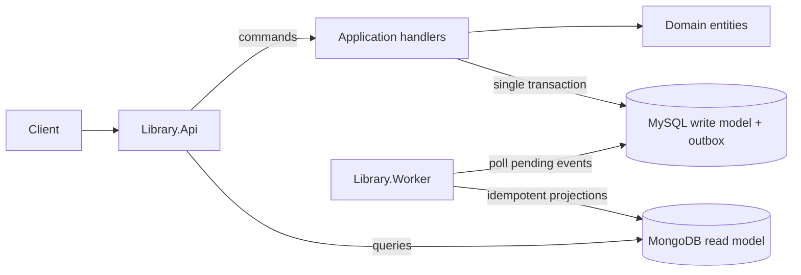

[English](README.md) | [Português](README.pt-BR.md)

# Library Lending System


Community library lending backend built with .NET 10, CQRS, MySQL, MongoDB, optimistic concurrency, and a transactional outbox.

> A small architecture case study focused on reliability, explicit trade-offs, and pragmatic domain modeling.

## Problem

The system creates and lists books, lends available copies, and returns loans. MySQL is the authoritative write model. MongoDB is a query-optimized, eventually consistent read model. A transactional outbox prevents the business write and synchronization intent from becoming a fragile dual write.

The case demonstrates protected domain invariants, explicit use-case handlers, EF Core concurrency tokens, RFC 7807 errors, at-least-once processing, idempotent versioned projections, bounded retry, and structured logs.

## Architecture



Dependency direction is `Domain <- Application <- Infrastructure <- API/Worker`. The application exposes focused persistence ports; it never exposes `DbContext`, `DbSet`, or `IQueryable`.

## Requirements coverage

| Requirement | Implementation |
|---|---|
| Rich domain model | `Book` and `Loan` protect their own invariants |
| Relational write model | MySQL + EF Core mappings and migration |
| NoSQL read model | MongoDB `book` and `loan` projections |
| CQRS | MySQL commands and MongoDB query handlers |
| Synchronization | Transactional outbox + one worker |
| Concurrency | Explicit optimistic `Book.Version` and `Loan.Version` tokens |
| Reliable failures | Bounded retry, attempt/error persistence, structured logs |
| Idempotency | Apply only newer projection versions |
| API errors | RFC 7807 with 400/404/409 mappings |
| Unit tests | Domain, application, and optional infrastructure xUnit projects |

## Technology stack

- .NET 10 and ASP.NET Core controllers
- C# 14
- Entity Framework Core 10 with the official MySQL provider
- MySQL as the authoritative write model
- MongoDB as the query-optimized read model
- Transactional Outbox with `BackgroundService`
- xUnit and Moq
- OpenAPI and Docker Compose

## Run with Docker Compose

Requirements: Docker with Compose support.

```bash
cp .env.example .env
docker compose up --build
```

The API is available at `http://localhost:8080`; Swagger UI is at `http://localhost:8080/swagger`, and the OpenAPI document is at `http://localhost:8080/swagger/v1/swagger.json`. MySQL migrations are applied by the API during startup with retry. The worker starts only after the API health check passes in Docker Compose, avoiding concurrent migration attempts.

Stop and remove containers with `docker compose down`; add `-v` only when you intentionally want to delete database volumes.

## Local development

Start MySQL and MongoDB, then use the default local values in `appsettings.json`:

```bash
dotnet tool restore
dotnet restore
dotnet run --project Library.Api
dotnet run --project Library.Worker
```

Configuration has one shape across local files and environment variables. Docker Compose reads `.env` only to interpolate container values, then passes standard .NET configuration keys to the API and worker:

| Variable | Purpose | Default in Compose |
|---|---|---|
| `ConnectionStrings__MySql` | Authoritative MySQL connection | Compose service connection |
| `ConnectionStrings__MongoDb` | MongoDB connection | `mongodb://mongodb:27017` |
| `MongoDb__Database` | Read-model database | `library_read` |
| `Outbox__PollingIntervalSeconds` | Idle polling delay, seconds | `2` |
| `Outbox__BatchSize` | Maximum messages per batch | `50` |
| `Outbox__MaxAttempts` | Bounded failure attempts | `10` |
| `Outbox__RetryDelaySeconds` | Delay between failed attempts, seconds | `5` |

Never commit `.env` or production credentials.

## API

Swagger UI is the recommended manual test surface after the containers are healthy:

1. Open `http://localhost:8080/swagger`.
2. Call `GET /health` or open `http://localhost:8080/health` to confirm the API is ready.
3. Call `POST /api/books` with a request such as:

```json
{
  "title": "Domain-Driven Design",
  "author": "Eric Evans",
  "publicationYear": 2003,
  "availableQuantity": 2
}
```

4. Copy the returned `id` into `POST /api/books/{bookId}/loans`.
5. Copy the returned loan `id` into `POST /api/loans/{loanId}/return`.

The OpenAPI document is available at `http://localhost:8080/swagger/v1/swagger.json`. The repository also includes [Library.Api.http](Library.Api/Library.Api.http) with the same request flow for IDE REST clients.

| Method | Route | Success |
|---|---|---|
| POST | `/api/books` | `201 Created` |
| GET | `/api/books` | `200 OK` |
| GET | `/api/books/{bookId}` | `200 OK` |
| POST | `/api/books/{bookId}/loans` | `201 Created` |
| GET | `/api/loans` | `200 OK` |
| GET | `/api/loans/{loanId}` | `200 OK` |
| POST | `/api/loans/{loanId}/return` | `204 No Content` |

Malformed input returns `400`, missing resources return `404`, and unavailable books, repeated returns, and write conflicts return `409`. Errors use RFC 7807 Problem Details. Command responses use committed write-side data; public GET operations always use MongoDB.

Typical error responses include the standard `type`, `title`, `status`, `detail`, and `instance` fields, plus application extensions when available:

```json
{
  "title": "Conflict",
  "status": 409,
  "detail": "The resource changed while this operation was being completed. Retry with fresh state.",
  "code": "resource.concurrency.conflict"
}
```

## Consistency, concurrency, and outbox

MySQL is the source of truth. MongoDB can briefly be stale, so loan commands always check MySQL. Strict read-your-writes is not promised. A stale GET may show a copy that has just been lent, but the next command still cannot violate availability.

`Book.Version` and `Loan.Version` are EF Core concurrency tokens. Two borrowers can read the same last copy, but only one versioned update commits; the other receives `409` and is not silently retried. The loan token also protects direct loan updates, such as concurrent returns.

Every state change and its outbox message are saved by the same EF Core `SaveChanges` transaction. The worker dispatches pending messages, records failures and attempts, and leaves exhausted messages in MySQL for inspection/reprocessing. Delivery is at least once, not exactly once. MongoDB replacements apply only a newer aggregate version, making duplicates and older events harmless.

## Tests

```bash
dotnet test Library.sln
dotnet test Library.sln --collect:"XPlat Code Coverage"
```

Domain tests exercise entity invariants. Application tests use Moq at infrastructure boundaries and verify persistence, outbox recording, and commit behavior. Optional infrastructure tests verify EF Core optimistic concurrency with two real `DbContext` instances and MongoDB projection idempotency:

```bash
$env:MYSQL_TEST_CONNECTION_STRING="server=localhost;port=3306;database=library;user=library;password=library;sslmode=Disabled;AllowPublicKeyRetrieval=True"
$env:MONGO_TEST_CONNECTION_STRING="mongodb://localhost:27017"
$env:MONGO_TEST_DATABASE="library_projection_test"
dotnet test Library.Infrastructure.Tests
```

Use disposable databases in these variables. The MySQL test recreates the mapped tables through EF Core migrations; the MongoDB test drops the configured projection database.

## Key decisions

- MySQL is the source of truth; MongoDB is an eventually consistent projection.
- Commands never use MongoDB to validate critical business invariants.
- EF Core was selected for assessment compliance, behind focused repositories.
- The outbox is processed directly without a broker in the initial architecture.
- One worker contains multiple event handlers and remains a single deployable unit.

Detailed trade-offs are documented in [DECISIONS.md](DECISIONS.md) and the three [ADRs](docs/adr).

## Deliberate limitations and evolution

- No authentication or authorization; intentionally outside scope.
- No strict read-your-writes or projection-lag endpoint.
- Outbox rows are retained; production operation should add a retention/archival job.
- Infrastructure tests require external MySQL and MongoDB instances and are not executed as part of the default unit-test workflow.
- A single worker instance is the expected initial deployment. The projections are idempotent, but the outbox table does not implement distributed claiming, locking, or leasing; multiple workers would need one of those before horizontal scaling.
- Useful metrics include pending count, oldest pending age, failure count, projection lag, and processing duration.
- With independent consumers or greater throughput, evolve the outbox publisher toward a broker and add an inbox pattern. Introduce neither before evidence justifies the operational cost.

See [DECISIONS.md](DECISIONS.md) for storage naming, persistence choices, and deliberately rejected complexity.
