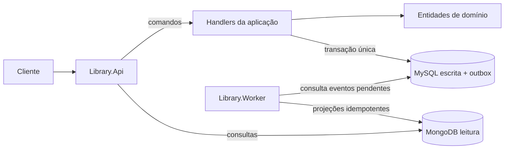

[English](README.md) | [Português](README.pt-BR.md)

# Library Lending System


Backend de empréstimos para bibliotecas comunitárias construído com .NET 10, CQRS, MySQL, MongoDB, concorrência otimista e outbox transacional.

> Um pequeno case de arquitetura focado em confiabilidade, trade-offs explícitos e modelagem de domínio pragmática.

## Problema

O sistema cadastra e lista livros, empresta exemplares disponíveis e devolve empréstimos. O MySQL é o modelo de escrita autoritativo. O MongoDB é um modelo de leitura otimizado e eventualmente consistente. Um outbox transacional evita transformar a escrita de negócio e a intenção de sincronização em um dual write frágil.

O case demonstra invariantes protegidas no domínio, handlers explícitos, tokens de concorrência do EF Core, erros RFC 7807, processamento at-least-once, projeções versionadas idempotentes, retry limitado e logs estruturados.

## Arquitetura



A direção de dependência é `Domain <- Application <- Infrastructure <- API/Worker`. A aplicação expõe portas focadas e nunca `DbContext`, `DbSet` ou `IQueryable`.

## Cobertura de requisitos

| Requisito | Implementação |
|---|---|
| Domínio rico | `Book` e `Loan` protegem invariantes |
| Escrita relacional | MySQL + EF Core + migration |
| Leitura NoSQL | Projeções MongoDB `book` e `loan` |
| CQRS | Comandos MySQL e consultas MongoDB |
| Sincronização | Outbox transacional + um worker |
| Concorrência | Tokens otimistas explícitos `Book.Version` e `Loan.Version` |
| Falhas confiáveis | Retry limitado, tentativa/erro persistidos e logs |
| Idempotência | Apenas versões de projeção mais novas são aplicadas |
| Erros da API | RFC 7807 com 400/404/409 |
| Testes unitários | Projetos xUnit de domínio, aplicação e infraestrutura opcional |

## Stack de tecnologia

- .NET 10 e controllers ASP.NET Core
- C# 14
- Entity Framework Core 10 com provider oficial MySQL
- MySQL como modelo de escrita autoritativo
- MongoDB como modelo de leitura otimizado para consultas
- Outbox transacional com `BackgroundService`
- xUnit e Moq
- OpenAPI e Docker Compose

## Executar com Docker Compose

Requisito: Docker com suporte a Compose.

```bash
cp .env.example .env
docker compose up --build
```

A API fica em `http://localhost:8080`; o Swagger UI fica em `http://localhost:8080/swagger`, e o documento OpenAPI fica em `http://localhost:8080/swagger/v1/swagger.json`. As migrations MySQL são aplicadas pela API ao iniciar, com retry. No Docker Compose, o worker só inicia após o health check da API passar, evitando tentativas concorrentes de migration.

Pare com `docker compose down`; use `-v` apenas se quiser apagar os volumes dos bancos.

## Desenvolvimento local

Inicie MySQL e MongoDB e use os valores locais de `appsettings.json`:

```bash
dotnet tool restore
dotnet restore
dotnet run --project Library.Api
dotnet run --project Library.Worker
```

A configuração tem um único formato entre arquivos locais e variáveis de ambiente. O Docker Compose lê `.env` apenas para interpolar valores dos containers e repassa chaves padrão do .NET para API e worker:

| Variável | Finalidade | Padrão no Compose |
|---|---|---|
| `ConnectionStrings__MySql` | Conexão MySQL autoritativa | Conexão do serviço Compose |
| `ConnectionStrings__MongoDb` | Conexão MongoDB | `mongodb://mongodb:27017` |
| `MongoDb__Database` | Banco do modelo de leitura | `library_read` |
| `Outbox__PollingIntervalSeconds` | Atraso entre consultas sem mensagens, em segundos | `2` |
| `Outbox__BatchSize` | Máximo de mensagens por lote | `50` |
| `Outbox__MaxAttempts` | Tentativas limitadas por falha | `10` |
| `Outbox__RetryDelaySeconds` | Atraso entre tentativas com falha, em segundos | `5` |

Nunca versione `.env` ou credenciais reais.

## API

O Swagger UI é o caminho recomendado para teste manual depois que os containers estiverem saudáveis:

1. Abra `http://localhost:8080/swagger`.
2. Chame `GET /health` ou abra `http://localhost:8080/health` para confirmar que a API está pronta.
3. Chame `POST /api/books` com um corpo como:

```json
{
  "title": "Domain-Driven Design",
  "author": "Eric Evans",
  "publicationYear": 2003,
  "availableQuantity": 2
}
```

4. Copie o `id` retornado para `POST /api/books/{bookId}/loans`.
5. Copie o `id` do empréstimo retornado para `POST /api/loans/{loanId}/return`.

O documento OpenAPI fica em `http://localhost:8080/swagger/v1/swagger.json`. O repositório também inclui [Library.Api.http](Library.Api/Library.Api.http) com o mesmo fluxo para REST clients da IDE.

| Método | Rota | Sucesso |
|---|---|---|
| POST | `/api/books` | `201 Created` |
| GET | `/api/books` | `200 OK` |
| GET | `/api/books/{bookId}` | `200 OK` |
| POST | `/api/books/{bookId}/loans` | `201 Created` |
| GET | `/api/loans` | `200 OK` |
| GET | `/api/loans/{loanId}` | `200 OK` |
| POST | `/api/loans/{loanId}/return` | `204 No Content` |

Entrada inválida retorna `400`, recurso ausente `404` e indisponibilidade, devolução repetida ou conflito de escrita `409`. Erros seguem RFC 7807. Respostas de comando usam o estado confirmado da escrita; todos os GETs públicos consultam MongoDB.

Respostas de erro normalmente incluem os campos padrão `type`, `title`, `status`, `detail` e `instance`, além de extensões da aplicação quando disponíveis:

```json
{
  "title": "Conflict",
  "status": 409,
  "detail": "The resource changed while this operation was being completed. Retry with fresh state.",
  "code": "resource.concurrency.conflict"
}
```

## Consistência, concorrência e outbox

MySQL é a fonte da verdade. MongoDB pode ficar brevemente defasado; comandos de empréstimo sempre validam no MySQL. Não há promessa de read-your-writes estrito. Um GET defasado pode exibir um exemplar recém-emprestado, mas o próximo comando ainda não viola disponibilidade.

`Book.Version` e `Loan.Version` são tokens de concorrência do EF Core. Dois pedidos podem ler o mesmo último exemplar, mas apenas uma atualização versionada confirma; a outra recebe `409`, sem retry silencioso. O token do empréstimo também protege alterações diretas no empréstimo, como devoluções concorrentes.

Cada mudança e sua mensagem de outbox são salvas pela mesma transação de `SaveChanges`. O worker despacha pendências, registra tentativas/erros e mantém mensagens esgotadas para inspeção. A entrega é at-least-once. O MongoDB só aceita versão mais nova do agregado, tornando duplicatas e eventos antigos inofensivos.

## Testes

```bash
dotnet test Library.sln
dotnet test Library.sln --collect:"XPlat Code Coverage"
```

Testes de domínio cobrem invariantes. Testes de aplicação usam Moq nas fronteiras de infraestrutura e verificam persistência, outbox e commit. Há também testes opcionais de infraestrutura para validar concorrência otimista do EF Core com dois `DbContext` reais e idempotência de projeção no MongoDB:

```bash
$env:MYSQL_TEST_CONNECTION_STRING="server=localhost;port=3306;database=library;user=library;password=library;sslmode=Disabled;AllowPublicKeyRetrieval=True"
$env:MONGO_TEST_CONNECTION_STRING="mongodb://localhost:27017"
$env:MONGO_TEST_DATABASE="library_projection_test"
dotnet test Library.Infrastructure.Tests
```

Use bancos descartáveis nessas variáveis. O teste MySQL recria as tabelas mapeadas via migrations do EF Core; o teste MongoDB remove o banco de projeção configurado.

## Decisões principais

- MySQL é a fonte da verdade; MongoDB é uma projeção eventualmente consistente.
- Comandos nunca usam MongoDB para validar invariantes críticas de negócio.
- EF Core foi escolhido para cumprir o requisito do case, atrás de repositórios focados.
- O outbox é processado diretamente, sem broker na arquitetura inicial.
- Um worker contém múltiplos handlers de eventos e permanece uma única unidade de deploy.

Trade-offs detalhados estão documentados em [DECISIONS.pt-BR.md](DECISIONS.pt-BR.md) e nos três [ADRs](docs/adr/pt-BR).

## Limitações deliberadas e evolução

- Sem autenticação/autorização, fora do escopo.
- Sem read-your-writes estrito ou endpoint de lag.
- Outbox é retido; produção deve adicionar retenção/arquivamento.
- Testes de infraestrutura exigem instâncias externas de MySQL e MongoDB e não rodam no fluxo padrão de testes unitários.
- O deploy inicial pressupõe uma instância do worker. As projeções são idempotentes, mas a tabela de outbox não implementa claim, lock ou lease distribuído; múltiplos workers exigiriam um desses mecanismos antes de escalar horizontalmente.
- Métricas úteis: pendências, idade da mais antiga, falhas, lag e duração.
- Com consumidores independentes ou maior volume, evoluir para broker e Inbox Pattern. Não introduzir antes de evidência concreta.

Veja [DECISIONS.pt-BR.md](DECISIONS.pt-BR.md) para nomes físicos de armazenamento, escolhas de persistência e complexidade rejeitada.
